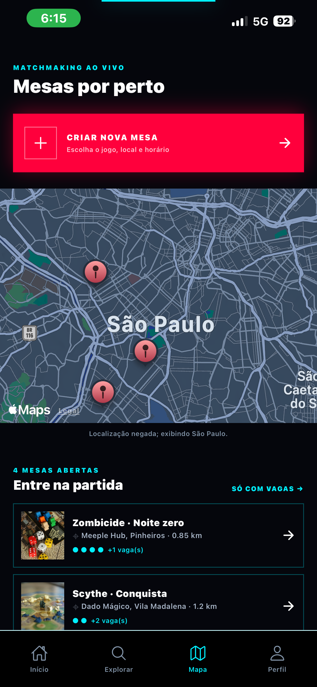
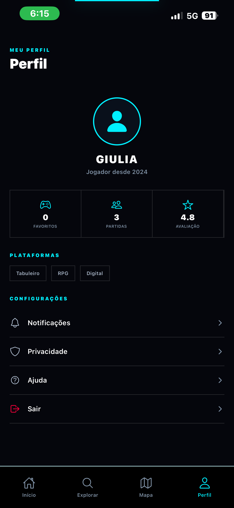
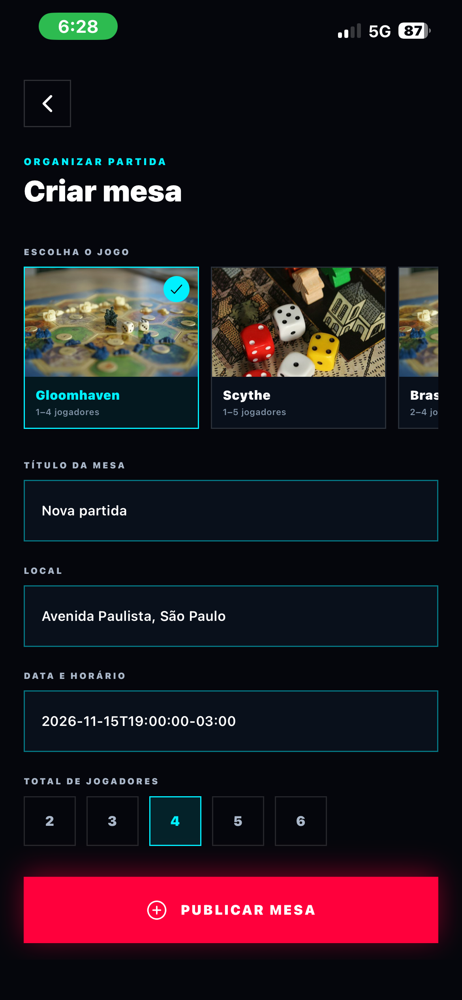

# 🎮 Party Pursuit

> **Encontre sua próxima mesa.** Descubra board games, localize partidas próximas e conecte-se a outros jogadores.


Projeto semestral da disciplina **Mobile Development & IoT**, desenvolvido em React Native com Expo para os Checkpoints 4, 5 e 6.

## Sobre o projeto

Encontrar pessoas disponíveis, um local adequado e um jogo em comum ainda é uma experiência fragmentada entre grupos de mensagens e eventos isolados. O Party Pursuit centraliza esse processo em uma experiência mobile:

- catálogo pesquisável de board games;
- favoritos persistentes;
- mesas próximas no mapa e em lista;
- criação de mesas com jogo, local, horário e capacidade;
- entrada e saída de partidas;
- perfil do jogador e notificações;
- funcionamento com dados do Supabase e fallback local.

## Evolução dos checkpoints

| Entrega | Evolução realizada | Situação |
|---|---|---|
| **CP4 — Idealização** | Problema, proposta de valor, identidade visual, Figma, arquitetura inicial e modelo de negócio | ✅ Concluído |
| **CP5 — Protótipo funcional** | Telas navegáveis, catálogo e mesas mockadas, busca, filtros, favoritos, participação, Jest e evidências visuais | ✅ Pronto para entrega |
| **CP6 — App final** | Supabase Auth/PostgreSQL, catálogo remoto, persistência, mapa, criação de mesas, fallback offline e configuração EAS | 🟡 Código pronto; APK pendente |

### Do protótipo ao app final

| CP5 | CP6 |
|---|---|
| Login e cadastro simulados | Autenticação e perfil no Supabase |
| Jogos em JSON local | Catálogo no PostgreSQL com fallback JSON |
| Mesas mockadas | Mesas remotas mescladas com mocks demonstrativos |
| Estado somente em memória | Zustand persistido com AsyncStorage |
| Mapa conceitual | Mapa Android com localização e fallback web |
| Participação local | Entrada/saída protegida por RPC transacional |
| Evidência no Expo/browser | Build Android instalável via EAS |

## Funcionalidades entregues

- Cadastro e login com validação de formulário.
- Nome do perfil sincronizado com o usuário autenticado.
- Catálogo de oito jogos cadastrado no Supabase.
- Busca e filtros por gênero.
- Detalhes, favoritos e persistência local.
- Mapa com solicitação de localização e fallback em São Paulo.
- Listagem conjunta de mesas remotas, locais e mockadas.
- Criação de mesa com seleção visual do jogo e capacidade.
- Entrada e saída de partidas, incluindo proteção contra mesa lotada.
- Central de notificações com estados lido e removido.
- Estados de rota não encontrada e dados indisponíveis.

## Arquitetura técnica

| Camada | Tecnologia | Responsabilidade |
|---|---|---|
| Aplicativo | Expo SDK 54 + React Native 0.81 | Runtime mobile e acesso aos recursos nativos |
| Navegação | Expo Router 6 | Rotas por arquivos e rotas dinâmicas |
| Linguagem | TypeScript strict | Tipagem e segurança durante o desenvolvimento |
| Estado local | Zustand + AsyncStorage | Filtros, favoritos e fallback persistente |
| Estado remoto | TanStack Query + Supabase JS | Consulta e sincronização dos dados |
| Backend | Supabase Auth + PostgreSQL | Usuários, catálogo, mesas, participantes e favoritos |
| Segurança | Row Level Security + RPCs | Isolamento por usuário e operações transacionais |
| Mapa | react-native-maps + expo-location | Localização e visualização das mesas |
| Qualidade | Jest + Testing Library + ESLint | Testes automatizados e análise estática |

```text
Supabase/PostgreSQL ──→ services ──→ Zustand/React Query ──→ telas
       ↑                                                    ↓
 Auth + RLS + RPCs                               JSON/AsyncStorage fallback
```

As migrations e o seed do catálogo estão em `supabase/migrations/`.

## Como executar

### Pré-requisitos

- Node.js 20 LTS ou superior;
- npm 10 ou superior;
- Expo Go ou emulador Android;
- projeto Supabase para utilizar o modo online.

### Instalação

```bash
git clone https://github.com/Giulia-Rocha/party-pursuit.git
cd party-pursuit
npm install
```

Copie o exemplo de ambiente:

```powershell
Copy-Item .env.example .env
```

Preencha sem versionar o arquivo:

```env
EXPO_PUBLIC_SUPABASE_URL=https://seu-projeto.supabase.co
EXPO_PUBLIC_SUPABASE_ANON_KEY=sua-chave-publica
EXPO_PUBLIC_GOOGLE_MAPS_API_KEY=sua-chave-google-maps
```

Inicie o Expo:

```bash
npx expo start --clear
```

- `npm run android`: abre no Android.
- `npm run web`: abre no navegador.
- Expo Go: leia o QR Code exibido no terminal.

## Qualidade e testes

```bash
npm run typecheck
npm test
npm run lint
```

Estado validado da entrega:

- TypeScript sem erros;
- 2 suítes e 6 testes automatizados passando;
- ESLint sem erros, com três avisos legados de BOM nos tokens visuais;
- build web validado com 18 rotas estáticas.

O roteiro de homologação está em [docs/roteiro-testes.md](./docs/roteiro-testes.md).

## Evidências do CP5

| Evidência | Tela/fluxo |
|---|---|
|  | Login |
|  | Cadastro |
|  | Home e descoberta |
|  | Busca e filtros |
|  | Detalhes de jogo |
|  | Mapa real, fallback de localização e mesas mockadas |
|  | Perfil sincronizado com o usuário autenticado |
|  | Notificações |
|  | Catálogo completo |
|  | Seleção de jogo e formulário de criação de mesa |
|  | Demonstração atualizada dos fluxos do CP5 e CP6 |

Os resultados e as evidências associadas estão registrados no roteiro manual do projeto.

## Baixar e instalar o APK do CP6

O Party Pursuit é distribuído para avaliação por meio de um link direto, fora da Google Play. A instalação está disponível somente para celulares e tablets Android.

> Instale o APK apenas pelo link compartilhado pela equipe do projeto. Não prossiga caso tenha recebido o arquivo de uma fonte diferente.

1. Abra no dispositivo Android o link do APK fornecido pela equipe.
2. Na página exibida, toque em **Download** para baixar o arquivo `.apk`.
3. O navegador poderá avisar que esse tipo de arquivo pode ser nocivo. Esse alerta aparece porque o aplicativo não foi publicado na Google Play. Confirme em **Fazer download mesmo assim** somente se estiver usando o link oficial do projeto.
4. Ao terminar, toque na notificação do download ou abra o aplicativo **Arquivos/Downloads** e selecione o APK.
5. Caso o Android bloqueie a instalação, toque em **Configurações** no aviso e habilite **Permitir desta fonte** para o navegador ou gerenciador de arquivos utilizado. Volte para a tela anterior.
6. Toque em **Instalar** e aguarde a conclusão.
7. Se o Google Play Protect informar que o desenvolvedor não é reconhecido ou que o aplicativo não foi verificado, abra **Mais detalhes** e escolha **Instalar mesmo assim**. Esse aviso é esperado em uma versão acadêmica distribuída fora da loja.
8. Toque em **Abrir** para iniciar o Party Pursuit e conceda a permissão de localização quando solicitada.

Depois da instalação, é recomendável voltar às configurações do Android e desativar **Permitir desta fonte**. Para instalar uma versão mais recente, baixe o novo APK pelo link atualizado e instale-o sobre a versão existente.

Os nomes dos botões podem variar de acordo com a versão do Android e o fabricante do aparelho. O APK não pode ser instalado em iPhone ou iPad.

## Estrutura principal

```text
app/                         rotas e telas Expo Router
├── (auth)/                  login e cadastro
├── (tabs)/                  home, explorar, mapa e perfil
├── details/[id].tsx         detalhes do jogo
├── party/[id].tsx           detalhes e participação na mesa
└── session/new.tsx          criação de mesa

src/
├── components/              componentes de jogos e mapa
├── data/                    fallback JSON
├── lib/                     Supabase e storage
├── providers/               inicialização dos dados e autenticação
├── services/                catálogo, mesas e favoritos
├── store/                   stores Zustand
└── types/                   contratos TypeScript

supabase/migrations/         schema, RLS, RPCs e catálogo inicial
docs/                        documentação e evidências
```

## Documentação

| Documento | Conteúdo |
|---|---|
| [Escopo](./docs/escopo.md) | Problema, público-alvo e proposta de valor |
| [Modelo de negócio](./docs/modelo-negocio.md) | Pitch, monetização e diferencial competitivo |
| [Arquitetura](./docs/arquitetura.md) | Decisões técnicas e fluxo dos dados |
| [Membros](./docs/membros.md) | Papéis e responsabilidades |
| [Fluxos](./docs/fluxos-navegacao.md) | Jornadas funcionais do aplicativo |
| [Roteiro de testes](./docs/roteiro-testes.md) | Cenários e evidências de homologação |
| [Manual de uso](./docs/manual-uso.md) | Instalação e operação do app final |

## Identidade visual

| Token | Valor | Uso |
|---|---|---|
| Ciano | `#00F0FF` | Destaques, ícones ativos e bordas |
| Magenta | `#FF003C` | Chamadas para ação e notificações |
| Ink | `#05060C` | Fundo principal |
| Tema | Cyberpunk escuro | Identidade geral |

[Protótipo no Figma](https://www.figma.com/make/q0A30PV2FeWpNxcWumpe8V/GameFinder-Mobile-App-Prototype?fullscreen=1&t=mX86JRN6WfHfD5GS-1&code-node-id=0-6)

## Equipe

| Membro | Papel principal |
|---|---|
| Giulia Rocha | Back-end, stores, Supabase e navegação |
| Gabriel Danius | Product Owner, escopo e documentação |
| Carlos Eduardo | Front-end, componentes e design system |
| Caio Rossini | UI/UX, identidade visual e protótipo |

---

Projeto acadêmico — FIAP, Engenharia de Software, 3º ano.

Disciplina: Mobile Development & IoT.
