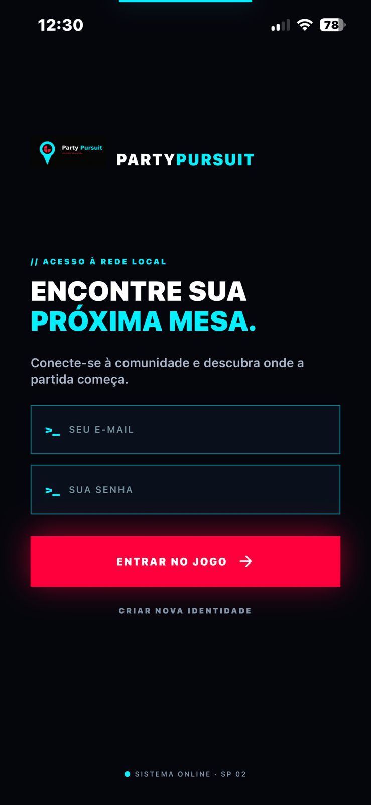
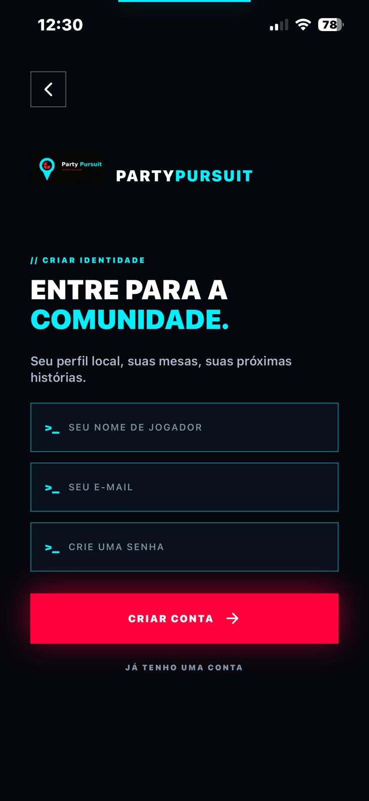
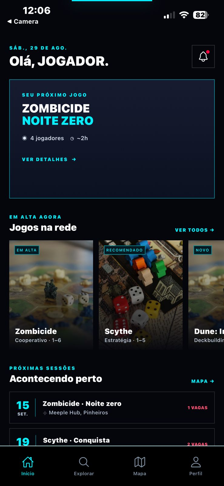
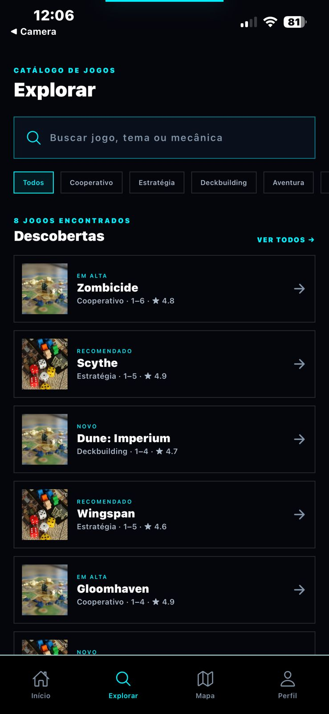
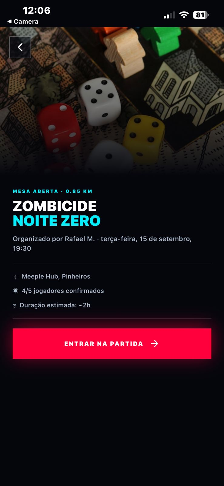
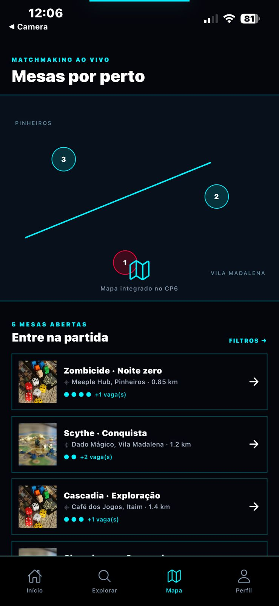
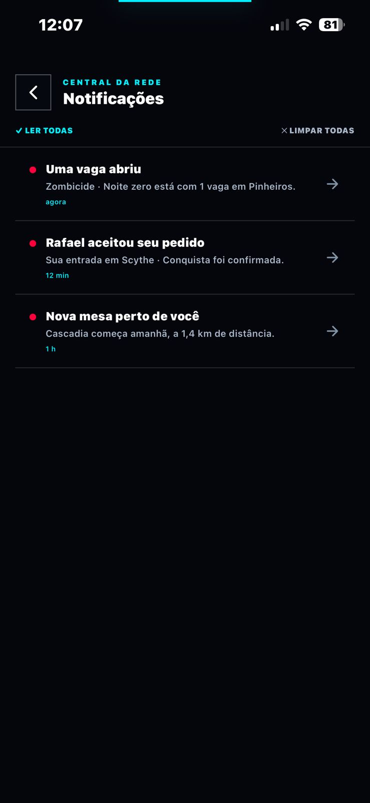
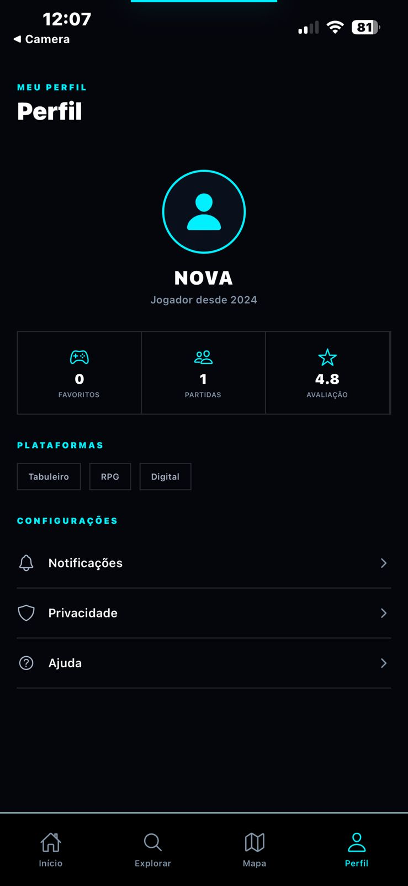
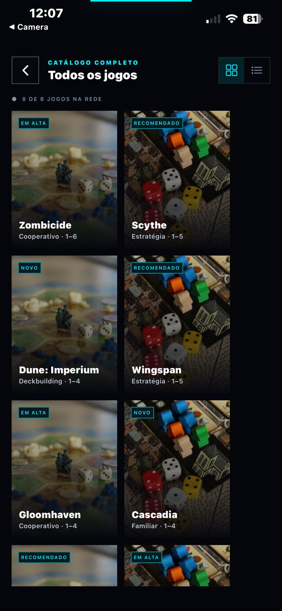

# 🎮 Party Pursuit

> **Encontre sua próxima mesa.** Descubra board games e conecte-se a jogadores perto de você.


---

## 📱 Sobre o App

O **Party Pursuit** resolve um problema real da comunidade de board gamers: **é difícil encontrar grupos para jogar**. O app conecta jogadores locais, exibe sessões abertas perto de você e permite descobrir novos jogos de acordo com o seu perfil.

### 🎯 Problema
Grupos de board games vivem dispersos em grupos de WhatsApp, Discord e eventos avulsos — sem centralização, sem descoberta, sem matchmaking.

### 💡 Solução
Uma plataforma mobile que funciona como **"Tinder para board games"**: você descobre jogos, vê mesas abertas no mapa e entra nas partidas com um toque.

---

## 👥 Time

| Membro | Papel | Responsabilidades |
|--------|-------|-------------------|
| **Giulia Rocha** | Desenvolvedora Back-end | Stores Zustand, tipos TypeScript, dados mockados, navegação |
| **Gabriel Danius** | Product Owner | Backlog, priorização, documentação de escopo e modelo de negócio |
| **Carlos Eduardo** | Desenvolvedor Front-end | Componentes de UI, telas, design system, fidelidade ao Figma |
| **Caio Rossini** | UI/UX Design | Figma, identidade visual, paleta de cores, protótipo de telas |

---

## 🏗 Arquitetura

```
Stack: Expo SDK ~54.0.0 + Expo Router v4 (file-based) + Zustand + TypeScript
```

| Decisão | Escolha | Motivo |
|---------|---------|--------|
| **Roteamento** | Expo Router v4 (file-based) | Padrão moderno, similar ao Next.js, nativo para iOS/Android |
| **Estado global** | Zustand | Simples, sem boilerplate, fácil de escalar para API real no CP6 |
| **Linguagem** | TypeScript (strict) | Type safety desde o CP4, previne bugs no CP5/CP6 |
| **UI** | StyleSheet nativo + design system próprio | Performance máxima, fidelidade ao Figma |
| **Dados CP4/CP5** | JSON local mockado | Progressão natural → API real no CP6 |

### Fluxo de dados

```
src/data/*.json  →  src/store/use*Store.ts (Zustand)  →  app/**/*.tsx (telas)
                                                       →  src/components/** (componentes)
```

---

## 🚀 Como rodar localmente

### Pré-requisitos
- **Node.js** 20+
- **npm** 10+
- **Expo Go** instalado no iPhone (App Store) ou simulador iOS

### Instalação

```bash
# 1. Clone o repositório
git clone https://github.com/[seu-usuario]/party-pursuit.git
cd party-pursuit

# 2. Instale as dependências
npm install

# 3. Inicie o servidor de desenvolvimento
npx expo start
```

📱 **iOS físico:** Escaneie o QR Code com o **Expo Go** (App Store)  
💻 **Simulador:** Pressione `i` no terminal

---

## 📁 Estrutura de Pastas

```
cp04-mobile/
├── app/                    # Rotas e telas (Expo Router)
│   ├── (auth)/             # Telas de Login e Signup
│   ├── (tabs)/             # Tab bar: Home, Explorar, Mapa, Perfil
│   ├── details/[id].tsx    # Detalhe de jogo (dynamic route)
│   ├── party/[id].tsx      # Detalhe de sessão
│   ├── catalog.tsx         # Catálogo completo
│   └── notifications.tsx   # Central de notificações
│
├── src/
│   ├── components/         # Componentes reutilizáveis
│   │   ├── game/           # GameTile, GameRow
│   │   └── group/          # (CP5)
│   ├── constants/          # Design System (Colors, Typography, Spacing)
│   ├── store/              # Estado global (Zustand)
│   ├── types/              # TypeScript interfaces
│   └── data/               # Mock data JSON
│
└── docs/                   # Documentação do projeto
```

> Veja [docs/arquitetura.md](./docs/arquitetura.md) para decisões técnicas detalhadas.

---

## 📸 Imagens do App

Abaixo estão os prints das principais telas e componentes do Party Pursuit desenvolvidos para o Checkpoint 4 e 5:

| Foto | Descrição |
|------|-----------|
|  | **Tela de Login:** Acesso ao app com a nova identidade visual. |
|  | **Tela de Cadastro:** Formulário de registro de novos jogadores. |
|  | **Home:** Lista de jogos em destaque e mesas próximas. |
|  | **Explorar:** Busca de títulos e filtros por categorias. |
|  | **Detalhes do Jogo:** Informações, avaliações e mesas ativas do jogo escolhido. |
|  | **Mapa de Grupos:** Mapa interativo para buscar grupos de jogos próximos. |
|  | **Notificações:** Tela de Notificações |
|  | **Perfil:** Perfil, configurações, privacidade. |
|  | **Jogos** Busca de Jogos, Filtro por tema. |
|  | **GIF de Funcionamento do App**  |


---

## 🎨 Identidade Visual

| Token | Valor | Uso |
|-------|-------|-----|
| Cor primária | `#00F0FF` — Ciano neon | Destaques, ícones ativos, bordas |
| Cor de ação | `#FF003C` — Magenta | Botão CTA principal, notificações |
| Background | `#05060C` — Ink | Fundo base de todas as telas |
| Tema | Dark cyberpunk / terminal hacker | — |

> 🎨 Design no Figma:[Figma]()

---

## 📋 Checkpoints

- [x] **CP4** — Idealização: conceito, marca, documentação, estrutura técnica completa
- [ ] **CP5** — Protótipo funcional: telas completas, navegação, testes com Jest
- [ ] **CP6** — App final: integração com API real + APK instalável

---

## 📄 Documentação

| Documento | Descrição |
|-----------|-----------|
| [docs/escopo.md](./docs/escopo.md) | Problema, público-alvo e proposta de valor |
| [docs/modelo-negocio.md](./docs/modelo-negocio.md) | Pitch e modelo de negócio |
| [docs/arquitetura.md](./docs/arquitetura.md) | Decisões técnicas e arquitetura |
| [docs/membros.md](./docs/membros.md) | Papéis e responsabilidades do time |

---

## 📜 Licença

Projeto acadêmico — FIAP, Engenharia de Software, 3º Ano  
Disciplina: Mobile Development & IoT — Prof. Hercules Ramos

**#KeepCoding #ReactNative #FIAP**
